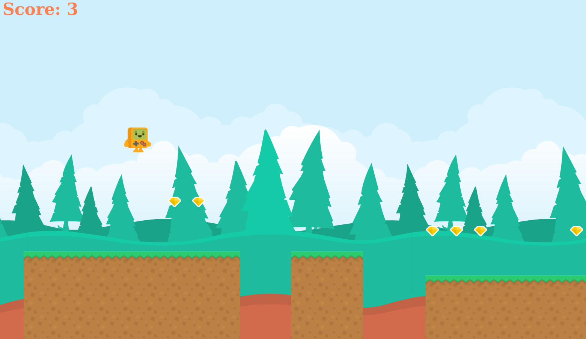

# Infinite runner html5 game

A simple PixiJs project created by following this tutorial: https://gamedev.land/runner/

Preview demo: 

# Running
1. Clone
2. Install dependencies with `npm install pixi.js` and `npm install matter-js`
3. Run the application with `npm run-script start`
